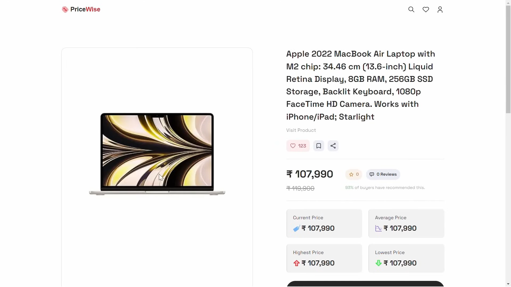
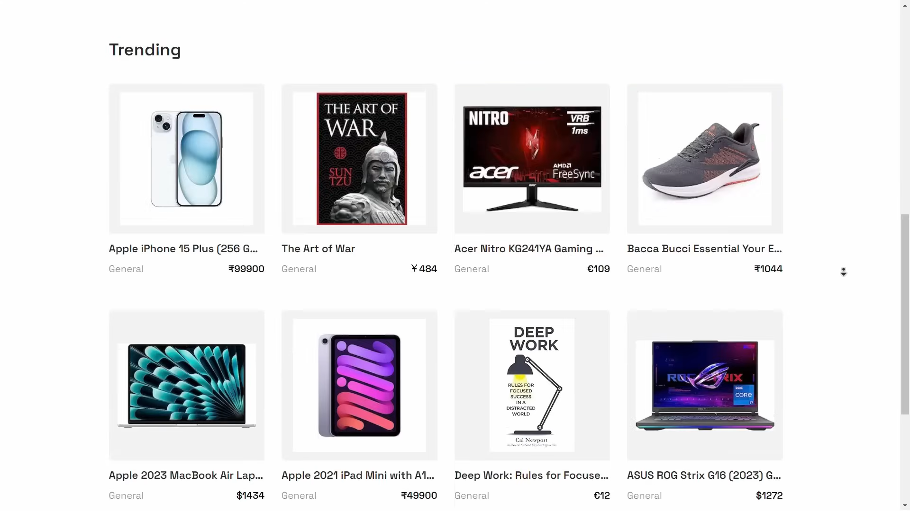
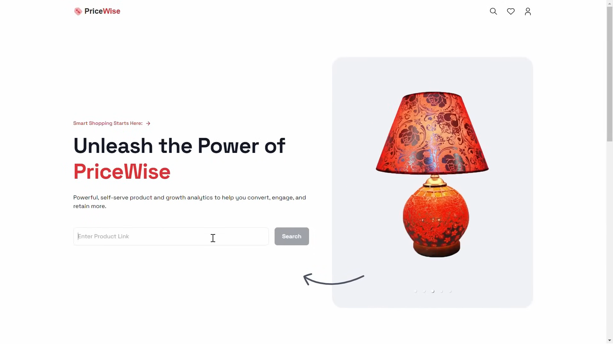
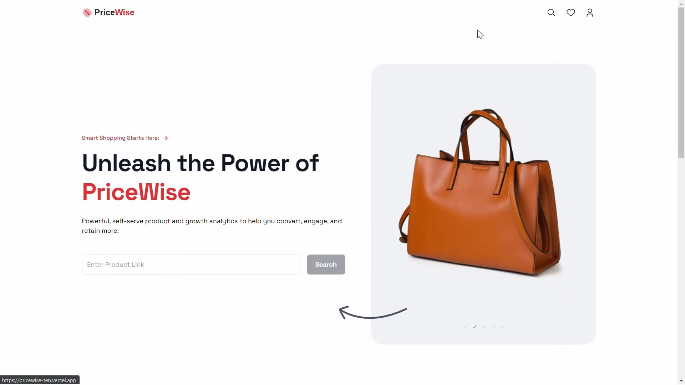

# Next.js-E-Commerce-Aggregator

```markdown
# Pricewise Project

## 🤸 Quick Start

Follow these steps to set up the project locally on your machine.

### Prerequisites

Make sure you have the following installed on your machine:

- Git
- Node.js
- npm (Node Package Manager)

### Cloning the Repository

First, clone the repository to your local machine:
```


### Installation

Install the project dependencies using npm:

```bash
npm install
```

### Set Up Environment Variables

Create a new file named `.env` in the root of your project and add the following content:

```plaintext
# SCRAPER
BRIGHT_DATA_USERNAME=
BRIGHT_DATA_PASSWORD=

# DB
MONGODB_URI=

# OUTLOOK
EMAIL_USER=
EMAIL_PASS=
```

Replace the placeholder values with your actual credentials. You can obtain these credentials by signing up on the following websites:

- [BrightData](https://brightdata.com/)
- [MongoDB](https://www.mongodb.com/)
- [Node Mailer](https://nodemailer.com/)

### Running the Project

Run the project locally by using the following command:

```bash
npm run dev
```

Once the project is running, open [http://localhost:3000](http://localhost:3000) in your browser to view the project.

---

<div style="display: grid; grid-template-columns: 1fr 1fr; gap: 10px;">
  <div style="padding: 5px;">
    
  </div>
  <div style="padding: 5px;">
    
  </div>
  <div style="padding: 5px;">
    
  </div>
  <div style="padding: 5px;">
    
  </div>
</div>


